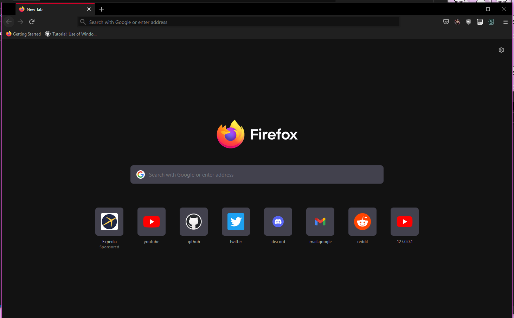

# Deprecation notice

This project will be superseded by a more complex Firefox theme of the same name by different developers. Therefore, this repository has been renamed to Phroton Legacy and archived.

# Phroton Legacy

Make Proton look like Photon.

This is a userChrome.css file that will restore the old Firefox UI on newer versions.

# Prerequisites

In order for icons to display properly, you must enable `svg.context-properties.content.enabled`
in about:config. (This is the case on FF91, but it doesn't seem to be so true around FF102)

# Extras

Since Firefox 106, private browsing may be separated into multiple windows. If you desire the old behaviour, disable `browser.privateWindowSeparation.enabled`.

# Known issues

- No arrows on popup menus on versions around Firefox 100
- Directly changing uidensity through about:config requires
  a restarted browser session in order to adjust omnibox scaling.
  **This does not occur through the Customise Firefox page.**
- Most popup menus need to be reworked for Photon style.
- Download button animations need to be replaced.
- Built-in dark theme has wrong icon colours on main toolbar
- A few other minor issues (button dimensions, etc.)
